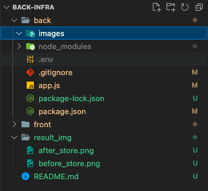
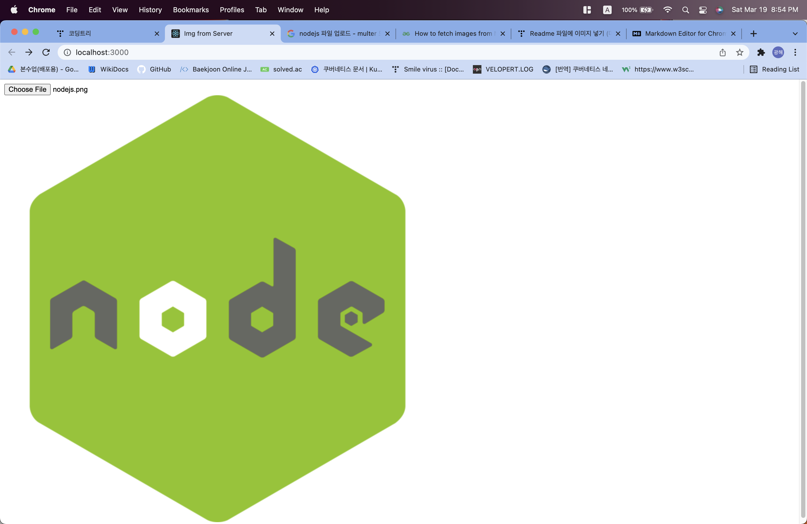
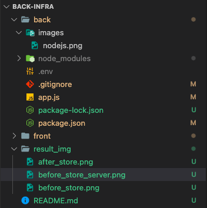

# 이미지파일을 업로드 하고 업로드된 사진을 페이지에 노출시킬수 있게 만들기
---
- 조건1. 사용 스택 상관없음 ( 노드js , spring, flask, django)
- 조건2. 프론트 꾸밀필요없음 꾸미고 싶은사람 꾸며도됨!
- 조건3. 서버내에 로컬 스토리지에 이미지 파일 저장하기
- 조건4. github에 올리기!
--- 
- 사진 업로드 하기 전

- 사진 업로드 한 후

